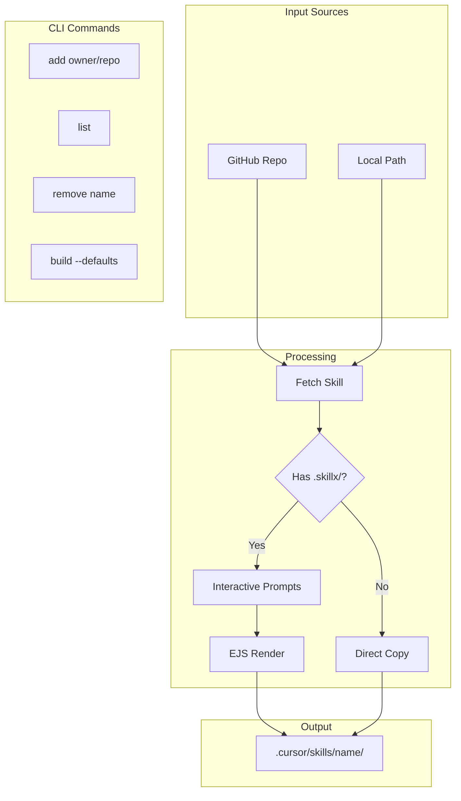

# Customizable Skills CLI

## Architecture Overview



## File Structure

### CLI Project Structure

```
skills-cli/
├── package.json
├── tsconfig.json
├── src/
│   ├── index.ts              # Entry point, command routing
│   ├── commands/
│   │   ├── add.ts            # Install skill from GitHub
│   │   ├── list.ts           # List installed skills
│   │   ├── remove.ts         # Remove installed skill
│   │   └── build.ts          # Generate defaults from templates
│   ├── lib/
│   │   ├── github.ts         # Fetch repos, download tarballs
│   │   ├── config.ts         # Parse skill.config.toml
│   │   ├── prompts.ts        # Interactive prompting logic
│   │   ├── render.ts         # EJS template rendering
│   │   └── paths.ts          # Output path resolution
│   └── types.ts              # TypeScript types
├── bin/
│   └── skills.ts             # CLI binary entry
```

### Customizable Skill Structure

The `.taito/` folder contains all customization files, completely separate from the standard skill files. This ensures:

- Other CLIs (like Vercel's) see only the standard `SKILL.md`, `scripts/`, `references/`
- Template files are never accidentally copied to output
- Clean separation between "source" templates and "built" defaults

```
react-localization/
├── SKILL.md                  # Default output (backwards compatible)
├── scripts/
│   └── find-strings.sh       # Default script
├── references/
│   └── REFERENCE.md
└── .taito/                  # Customization folder (hidden from other CLIs)
    ├── skill.config.toml     # Variable definitions
    ├── SKILL.md.ejs          # Template for SKILL.md
    ├── scripts/
    │   └── find-strings.sh.ejs   # Template (mirrors parent structure)
    └── references/
        └── REFERENCE.md.ejs  # Template (if customization needed)
```

**Key points:**

- `.taito/` mirrors the standard skill directory structure
- Each `.ejs` file in `.taito/` corresponds to an output file in the parent
- Files without an `.ejs` counterpart in `.taito/` are copied as-is from the parent
- The `build` command renders `.taito/` templates with defaults to update root-level files

## Configuration Format (TOML)

```toml
# .taito/skill.config.toml

[meta]
name = "react-localization"
version = "1.0.0"

# Simple string variable
[variables.SOURCE_LANGUAGE]
type = "string"
prompt = "What is your source language?"
default = "English"

# Choice variable
[variables.T_FUNCTION_FORMAT]
type = "choice"
prompt = "Which t() function format do you use?"
default = "string"

  [[variables.T_FUNCTION_FORMAT.options]]
  value = "string"
  label = "String: t('namespace:key')"

  [[variables.T_FUNCTION_FORMAT.options]]
  value = "callback"
  label = "Callback: t(($) => $.key)"

# Array variable
[variables.SUPPORTED_LANGUAGES]
type = "array"
prompt = "Which languages do you support? (comma-separated)"
default = ["en"]

# Path variable with pattern
[variables.TRANSLATION_PATH]
type = "string"
prompt = "Translation file path pattern"
default = "src/locales/{{ns}}/{{lng}}.json"
```

## Template Format (EJS)

Example `.taito/SKILL.md.ejs`:

```markdown
## Source language

The source language is <%= SOURCE_LANGUAGE %>.

## t() Function Format

<% if (T_FUNCTION_FORMAT === "callback") { %>
Always use the callback format:

\`\`\`tsx
t(($) => $.navigation.next);
\`\`\`
<% } else { %>
Always use the string format:

\`\`\`tsx
t("common:navigation.next");
\`\`\`
<% } %>

## Supported Languages

<% SUPPORTED_LANGUAGES.forEach(lang => { %>

- <%= lang %>
  <% }) %>
```

## CLI Commands

### `add` - Install a skill

```bash
# From GitHub (interactive)
bunx taito add owner/repo

# From GitHub with preset config
bunx taito add owner/repo --config ./answers.toml

# Dry run (preview without writing)
bunx taito add owner/repo --dry-run

# Custom output directory
bunx taito add owner/repo --output ./my-skills/
```

**Flow:**

1. Parse `owner/repo` argument
2. Fetch skill from GitHub (download tarball, extract)
3. Check for `.taito/` folder
4. If customizable (`.taito/` exists):

- Parse `.taito/skill.config.toml`
- Prompt user for each variable
- Render `.ejs` templates from `.taito/` with user values
- Copy non-templated files from root (those without `.taito/` counterpart)

1. If standard skill (no `.taito/`):

- Copy `SKILL.md`, `scripts/`, `references/` directly

1. Write to `.cursor/skills/[name]/`

### `list` - List installed skills

```bash
bunx taito list
```

Output:

```
Installed skills:
  - react-localization (customized)
  - code-review
```

### `remove` - Remove a skill

```bash
bunx taito remove react-localization
```

### `build` - Generate defaults from templates

For skill authors to regenerate root-level files from `.taito/` templates using default values. This keeps the backwards-compatible `SKILL.md` in sync with the templates:

```bash
# Build in current directory
bunx taito build

# Or specify path
bunx taito build ./my-skill/
```

**Flow:**

1. Read `.taito/skill.config.toml` for default values
2. Render all `.ejs` templates with defaults
3. Write output to parent directory (e.g., `.taito/SKILL.md.ejs` -> `SKILL.md`)

## Key Dependencies

| Package          | Purpose                       |
| ---------------- | ----------------------------- |
| `@clack/prompts` | Beautiful interactive prompts |
| `ejs`            | Template rendering            |
| `smol-toml`      | TOML parsing (fast, small)    |
| `tar`            | Extract GitHub tarballs       |
| `commander`      | CLI argument parsing          |

## Implementation Details

### GitHub Fetching

Use GitHub's tarball API to fetch without requiring git:

```typescript
// GET https://api.github.com/repos/{owner}/{repo}/tarball/{ref}
// or https://codeload.github.com/{owner}/{repo}/tar.gz/{ref}
```

Extract to temp directory, process, then clean up.

### Variable Types

| Type      | Prompt Style                 | Output     |
| --------- | ---------------------------- | ---------- |
| `string`  | Text input                   | `string`   |
| `choice`  | Select menu                  | `string`   |
| `boolean` | Confirm y/n                  | `boolean`  |
| `array`   | Text input (comma-separated) | `string[]` |

### Template Processing

1. Scan `.taito/` for all `.ejs` files (preserving directory structure)
2. For each template in `.taito/`:

- Render with user variables
- Write to output path, mapping `.taito/foo.ejs` to `output/foo`

1. Scan root skill directory for files that don't have a `.taito/` counterpart:

- Copy these files directly to output (e.g., images, non-templated references)

1. Skip `.taito/` folder entirely from output

### Output Path Resolution

Default: `.cursor/skills/[skill-name]/`

Detect workspace root by looking for:

1. `.cursor/` directory
2. `.git/` directory
3. `package.json`
4. Current working directory as fallback

## Edge Cases

1. **Skill already installed** - Prompt to overwrite or skip
2. **Network errors** - Graceful error messages with retry suggestion
3. **Invalid TOML** - Parse error with line number
4. **Missing required variable** - Error during render, not silently fail
5. **Private repos** - Support `GITHUB_TOKEN` env var for auth

## Example Session

```
$ bunx taito add aikoa/react-localization

Fetching aikoa/react-localization...

Customizable skill detected. Answer the following questions:

◆ What is your source language?
│ English
│
◆ Which t() function format do you use?
│ ○ String: t('namespace:key')
│ ● Callback: t(($) => $.key)
│
◆ Which languages do you support? (comma-separated)
│ en, fi, sv
│
◆ Translation file path pattern
│ src/i18n/{{ns}}/{{lng}}.json

Writing to .cursor/skills/react-localization/
  SKILL.md
  scripts/find-strings.sh

Done.
```
